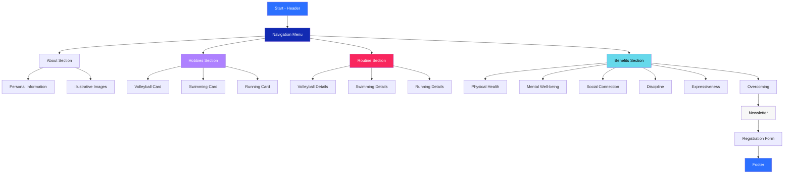

# AboutMe

A modern and responsive personal web page developed to showcase hobbies and interests related to physical activities. The project demonstrates the efficient use of **Flexbox CSS** to create a fluid layout adaptable to different screen sizes.

## Description

This project is a personal landing page that presents three main hobbies: **Volleyball**, **Swimming**, and **Running**. The page was developed with a focus on responsive design, using modern CSS Flexbox techniques to ensure a pleasant visual experience on mobile devices, tablets, and desktops.

The application presents information organized into distinct sections, including a personal introduction, hobby gallery, details about the routine of each activity, benefits provided, and a newsletter form for visitor engagement.

## Features

- **Responsive Navigation Menu**: Anchor links for smooth navigation between sections
- **About Section**: Personal presentation with illustrative images
- **Hobby Gallery**: Colorful cards highlighting each activity
- **Detailed Routine**: Specific information about the practice of each hobby
- **Benefits**: List of advantages provided by the activities
- **Newsletter**: Email registration form
- **Responsive Design**: Layout adaptable to different devices

## Technologies Used

- **HTML5**: Semantic content structuring
- **CSS3**: Advanced styling and animations
- **Flexbox**: Flexible and responsive layout system
- **Google Fonts**: Nunito typography for better readability

## Navigation Flow

## Responsiveness

The project uses Flexbox and media queries to ensure an optimized experience on:

- **Desktop**: Full layout with multiple columns
- **Tablet**: Automatic column adjustment (max-width: 800px)
- **Mobile**: Single column layout (max-width: 600px)

## Applied Concepts

- **Flexbox Layout**: `display: flex`, `flex-wrap`, `justify-content`, `align-items`
- **Responsive Design**: Media queries and flexible units
- **CSS Grid**: Grid element organization
- **Semantic HTML**: Proper use of semantic tags
- **CSS Custom Properties**: Value reusability
- **Mobile First**: Responsive approach

## Author

**Luiz Augusto Oliveira**
